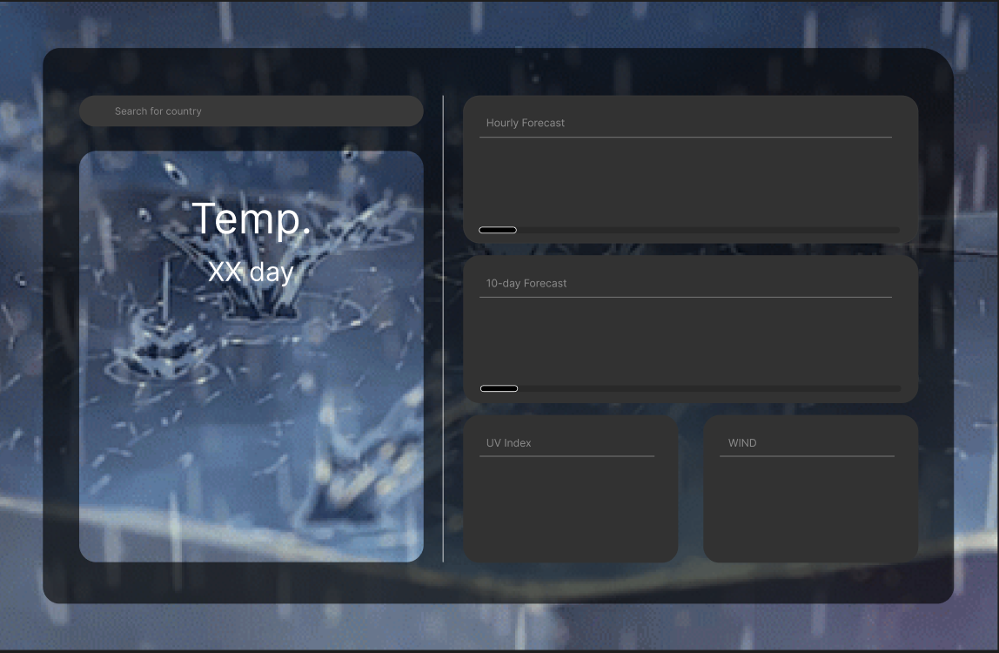
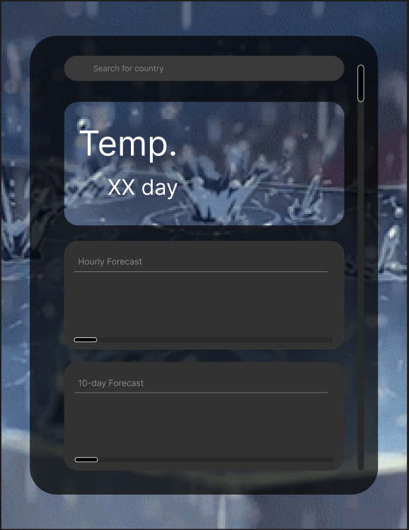

## React Weather

# 1. API usage
this weather website is using the open-source api :
[Open-Meteo](https://www.npmjs.com/package/openmeteo)

# To-do list ✅ ❌
1. loading screen for reading the content of the cities ❌

2. with different size of the screen, it come with a different structure of the content ❌

3. Fixing the error of the search system of the cities ❌

4. Hourly item needed to be fixed ✅

5. the structure of the item need to be fixed ❌

# Pictures

