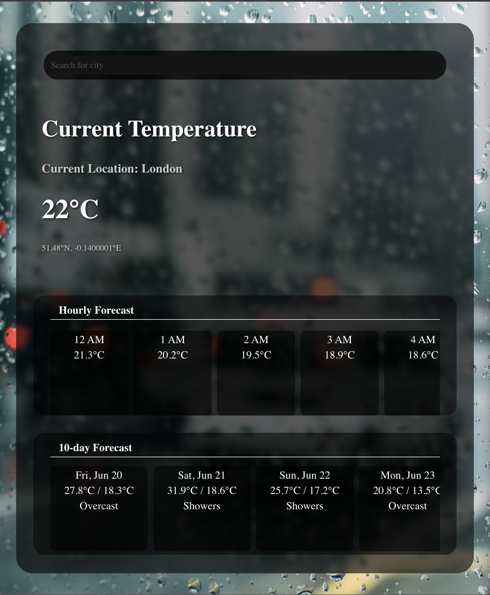

## Weather Dashboard Project
This is a React-based weather dashboard application that displays current and forecasted weather data, including temperature, wind conditions, UV index, hourly forecasts, and a 10-day outlook. The app features an interactive compass for wind direction, a search modal for location selection, and a responsive design.

## Table of Contents
- [API usage](#api-usage)
- [Features](#features)
- [Project Structure](#project-structure)
- [Picture](#pictures)
- [Configuration](#configuration)

## API usage
this weather website is using the open-source api :
[Open-Meteo](https://www.npmjs.com/package/openmeteo)


## Features
- Displays current temperature, wind speed, direction, UV index, hourly forecasts, and 10-day weather outlook.
- Interactive compass with a rotating arrow indicating wind direction (meteorological convention: 0° = north, 90° = east).
- Search functionality to select cities using the Open-Meteo Geocoding API.
- Responsive layout with adjustments for mobile and desktop views.
- Smooth animations for compass rotation using CSS transitions.
- Error handling for failed data fetches.
- Loading state during data retrieval.

## Project Structure
```
├── src/
│   ├── components/
│   │   ├── Data.js         # Context for weather data and API fetching
│   │   └── SearchBar.js    # Search bar component (not fully shown)
│   ├── pages/
│   │   ├── AppContent.js   # Main layout component
│   │   ├── App.jsx         # App entry point
│   │   ├── Hourly.js       # Hourly forecast component
│   │   ├── Main.js         # Current temperature component
│   │   ├── Search.js       # Search modal component
│   │   ├── Tenday.js       # 10-day forecast component
│   │   ├── UV.js          # UV index component
│   │   └── Wind.js         # Wind compass component
│   ├── Css/
│   │   ├── Hourly.css      # Styles for hourly forecast
│   │   ├── Main.css        # Styles for main temperature
│   │   ├── Search.css      # Styles for search modal
│   │   ├── Tenday.css      # Styles for 10-day forecast
│   │   ├── UV.css          # Styles for UV index
│   │   └── Wind.css        # Styles for wind compass
│   ├── App.css             # Global app styles
│   └── index.js            # React DOM rendering
├── package.json            # Project dependencies and scripts
└── README.md               # This file
```

## Pictures




## Configuration
- Weather API: The app uses Open-Meteo APIs for geocoding and weather data. Edit src/components/Data.js to customize the weather data fetch endpoint if needed. Example:

```javascript
const fetchWeatherData = async (cityName) => {
  try {
    const geoResponse = await fetch(`https://geocoding-api.open-meteo.com/v1/search?name=${encodeURIComponent(cityName)}&count=10&language=en&format=json`);
    const geoData = await geoResponse.json();
    const { latitude, longitude } = geoData.results[0] || {};
    if (latitude && longitude) {
      const weatherResponse = await fetch(`https://api.open-meteo.com/v1/forecast?latitude=${latitude}&longitude=${longitude}&hourly=temperature_2m&daily=weather_code,temperature_2m_max,temperature_2m_min,uv_index_max&current_weather=true&temperature_unit=celsius&windspeed_unit=ms&timeformat=unixtime`);
      const weatherData = await weatherResponse.json();
      setWeatherData(weatherData);
      setCurrentTemperature(weatherData.current_weather?.temperature);
      setCity(cityName);
    }
  } catch (err) {
    setError('Failed to fetch weather data');
  }
};
```